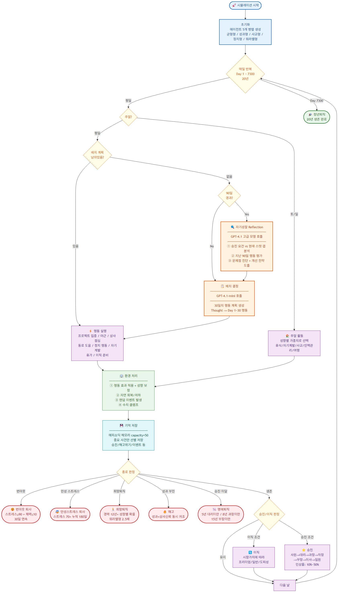

# 개인 프로젝트 : AI Simulation (회사원) - 코드 리뷰

## 목차

**[1. 프로젝트 소개 + 아키텍처](#1-프로젝트-소개--아키텍처)**

- 주제: 성향별 회사원 20년 시뮬레이션
- 목적: 딥 에이전트 기능 심화 학습
- architecture.png로 서비스 흐름 설명

**[2. 시뮬레이션 결과](#2-시뮬레이션-결과)**

- 5가지 성향 비교 HTML → 누가 승진하고, 누가 해고되는지
- 정치형 Reflection A/B 비교 HTML → 성찰 유무에 따른 차이

**[3. 전체 코드 흐름 + Reflection 심화](#3-전체-코드-흐름--reflection-심화)**

- Reflection 기본 구조: 90일마다 gpt-4.1이 자기평가 → 다음 30일 계획에 반영
- 구현 과정에서 겪은 문제들:
    - 1단계: 기본 구조 구현 → 성찰 내용이 추상적, Reflect가 오히려 역효과
    - 2단계: 수치 제공 + 주기 90일 + 처방 형식 → 구체성은 살렸지만 mini 모델이 무시
    - 3단계: 프롬프트 3곳 강화 (`[!][!][!]`, 강제 원칙) → 야근 남발 → 번아웃 악순환
    - 4단계: 체력/스트레스 관리 원칙 + 희망퇴직 경고 → **최종 성공 (17년 부장 vs 5년 사원)**
- 핵심 교훈: **LLM에게 "하라고 텍스트로 말하는 것"과 "구조적으로 하게 만드는 것"은 다르다.**

**4. Q&A**

---

# 1. **프로젝트 소개 + 아키텍처**

## **소개**

- 주제 : 성향별 20년 동안 회사에서 살아남기
- 목적 : 딥 에이전트 기능 심화 학습 (Reflection)
  - LLM이 직접 **의사결정 주체**가 되어 자율적으로 행동하고, 그 결과를 관찰하는 구조

> **핵심 질문: 어떤 성향이 회사에서 가장 오래, 가장 높이 올라갈까?**

| 성향 | 전략 |
|------|------|
| 균형형 | 모든 스탯을 고르게 올림 |
| 성과형 | 업무 능력과 성과에 올인 |
| 사교형 | 동료 관계와 평판에 집중 |
| 정치형 | 상사 라인을 타고 정치력으로 승부 |
| 워라밸형 | 스트레스 관리와 체력 유지에 집중 |

- **Reflection(자기성찰) on/off 비교**
  - 일정 기간마다 자기 상태를 돌아보고 전략을 수정하는 기능
  - 효과가 있는지, 오히려 방해가 되는지 같은 성향끼리 비교 실험

## **아키텍처**

> 핵심 흐름: 매일 루프 → 30일 배치 결정(LLM) → 90일 Reflection(LLM) → 환경 처리 → 종료 판정



1. 초기화 단계에서 에이전트 5개를 병렬 생성
2. 매일 반복 루프에 들어감
3. 하루의 흐름
    1. 주말인지 평일인지 구분
        1. 주말인 경우, LLM 호출 없이 성향별 가중치로 활동을 자동 선택
        2. 평일인 경우, 30일치 행동 계획이 남았는지 확인
            - 계획이 남아있으면 → 하나 꺼내서 실행
            - 소진됐으면 → 여기서 두 가지 LLM 호출
                - 90일이 경과했으면 **Reflection LLM** (gpt-4.1) : 자기성찰. 승진 요건 대비 현재 스탯 갭 분석, 문제점 진단
                - 그 다음 **배치 결정 LLM** (gpt-4.1-mini) **:** 다음 30일치 행동 계획 생성
    2. 행동 실행
    3. 환경 처리에서 스탯 변동
    4. 랜덤 이벤트 발생
    5. 중요한 사건은 메모리에 저장
    6. 종료 판정 여부 확인
        1. 다양한 이유로 탈락할 수 있고, 20년을 버티면 정년퇴직 (번아웃, 만성 스트레스, 권고사직, 해고)

---

# 2. 시뮬레이션 결과

## 5가지 성향 비교 결과

| 순위 | 성향 | 최종 직급 | 연봉 | 생존 기간 | 결말 |
|:---:|------|:---:|---:|:---:|:---:|
| 1위 | **성과형** | 임원 | 3억 | 20년 | 현직유지 |
| 2위 | **사교형** | 임원 | 2.8억 | 20년 | 현직유지 |
| 3위 | **균형형** | 이사 | 1.8억 | 20년 | 정년퇴직 |
| 4위 | 워라밸형 | 과장 | 8,500만 | 15년 | 권고사직 |
| 5위 | 정치형 | 사원 | 4,100만 | 5년 | 권고사직 |

### 왜 이런 결과가 나왔나

- **성과형** — 업무 능력과 성과에 올인 → 승진 요건을 가장 빠르게 충족
- **사교형** — 평판으로 승진 요건 안정적 충족 + 동료 관계가 이벤트에서도 유리
- **균형형** — 어디서도 밀리지 않지만, 돌출 스탯이 없어서 임원까지는 못 감
- **워라밸형** — 스탯은 전부 충족했지만 승진 확률 판정에서 3번 탈락 → 권고사직
- **정치형** — 상사신뢰↑ 정치력↑ but 평판 0.2 → 대리 승진에 필요한 평판 12를 못 채움

### 스탯 그래프 특징

| 성향 | 높은 스탯 | 낮은 스탯 |
|------|----------|----------|
| 성과형 | 업무능력, 성과 (빠르게 상승) | - |
| 사교형 | 동료관계, 평판 (꾸준히 높음) | - |
| 워라밸형 | 체력↑ 스트레스↓ | 나머지 스탯 상승 느림 |
| 정치형 | 상사신뢰 | 평판 (바닥) |

## Reflection(자기성찰) on/off 비교 결과

> 가장 빨리 해고되는 **정치형**에 대해서 자기성찰을 할 경우 얼마나 변화가 있을지 실험

| | Reflection ON | Reflection OFF |
|---|---|---|
| 최종 직급 | **부장** | 사원 |
| 연봉 | 1.3억 | 4,100만 |
| 생존 기간 | 17년 | 5년 |
| 결말 | 희망퇴직 (자발적) | 권고사직 (평판 바닥) |

### 핵심

| | Reflection ON | Reflection OFF |
|---|---|---|
| 90일마다 | gpt-4.1이 스탯 갭 분석 + 처방 | (없음) |
| 행동 패턴 | 처방에 따라 평판 보완 행동 추가 | 정치 행동만 반복 |
| 평판 변화 | 0.2 → 12 돌파 (대리 승진 가능) | 0.2 고정 (승진 불가) |
| 결과 | 17년 부장, 희망퇴직 | 5년 사원, 권고사직 |

### 요약

> Reflection은 에이전트가 자기 약점을 인식하고 행동을 수정할 수 있게 해주는 기능

특히 성향에 의한 편향이 강한 에이전트(정치형처럼)에게 효과가 큼

다만, 구현 과정이 핵심에서 설명처럼 단순하지 않음 (구현 과정에서 겪은 문제들은 코드 리뷰에서 자세히 다룸)

---

# 3. **전체 코드 흐름** + Reflection 심화

## **전체 코드 흐름**

1. main.py 설정 / ThreadPoolExecutor 병렬 실행
2. _run_one(): ReActAgent + CompanyEnvironment 생성
3. run_simulation(): Day 1~7300 루프
4. 주말: env.step_weekend() (LLM 호출 없음)
5. 평일: decide_batch() → _build_memory_section() → LLM 호출 → 30일 계획
6. env.step(): 행동 효과 → 자연 변화 → 랜덤 이벤트 → 생존 판정
7. _store_episode_if_important(): 중요 사건만 메모리 저장

### **시작점: main.py**

상단에서 기본적인 설정 가능

```python
# ── 실험 설정 ──────────────────────────────────────────
EXPERIMENT_SEED    = 42     # 모든 에이전트가 동일한 이벤트 시퀀스를 경험 (랜덤 이벤트 순서를 고정하는 값) : 값 자체는 아무 숫자나 상관없고, 바꾸면 이벤트 순서가 달라짐
MAX_DAYS           = 7300   # 시뮬레이션 최대 기간 (일) — 20년
LOG_INTERVAL       = 30     # 콘솔 출력 주기 (일) — 분기마다
DECISION_INTERVAL  = 30     # 배치 결정 주기 (일) — 한달치 한 번에 결정

# ── Reflection 설정 ────────────────────────────────────
USE_REFLECTION     = False              # 자기성찰 기능 on/off
REFLECTION_INTERVAL = 90                # 성찰 주기 (일) — 분기마다
MODEL_DECISION     = "gpt-4.1-mini"     # 배치 결정 + 히스토리 압축용 (저렴/빠름)
MODEL_REFLECTION   = "gpt-4.1"          # Reflection 전용 (고품질)

# ── 비교할 성향 목록 ────────────────────────────────────
# 사용 가능한 성향: "균형형", "성과형", "사교형", "정치형", "워라밸형"
ACTIVE_PERSONALITIES = ["균형형", "성과형", "사교형", "정치형", "워라밸형"]

# ── A/B 비교 실험 설정 ────────────────────────────────────
# 특정 성향의 Reflection on/off를 나란히 비교하려면 여기에 성향명 추가
# 예: ["정치형"] → 정치형(Reflection) vs 정치형(NoReflect) 동시 실행
AB_COMPARE = ["정치형"]
# ────────────────────────────────────────────────────────
```

```python
# 병렬 실행
results_map: dict[str, dict] = {}
with ThreadPoolExecutor(max_workers=len(jobs)) as executor: # 스레드 풀 생성. 스레드 5개 준비
    # with 블록을 빠져나오는 순간 shutdown(wait=True)가 자동 호출
    # 1. 아직 실행 중인 스레드가 있으면 전부 끝날 때까지 대기
    # 2. 스레드 풀 완전 해제
    # with를 안 쓰고 executor.shutdown()을 직접 안 불러주면, 스레드가 프로그램 종료 후에도 남아서 좀비처럼 될 수 있습니다.
    future_to_key = {}
    for i, job in enumerate(jobs):
        future = executor.submit(_run_one, *job["args"], tqdm_position=i, **job["kwargs"])   # _run_one 함수를 비동기로 제출 → 5개 동시 실행 시작
        future_to_key[future] = job["key"]
    for future in as_completed(future_to_key):  # as_completed()로 끝나는 순서대로 결과 수거
        key = future_to_key[future]             # 어떤 future가 어떤 성향인지 매핑
        try:
            results_map[key] = future.result()
        except Exception as e:
            print(f"[오류] {key} 실행 실패: {e}")
```

### **_run_one() → 에이전트·환경 생성**

```python
def _run_one(personality_name: str, tqdm_position: int = 0,
             reflection_override: bool | None = None, name_suffix: str = "") -> dict:
    """단일 에이전트 시뮬레이션 실행 (스레드별 독립 실행)."""
    use_reflect = reflection_override if reflection_override is not None else USE_REFLECTION
    llm = LLMClient(model=MODEL_DECISION)                                     # 배치 결정용 LLM
    llm_reflect = LLMClient(model=MODEL_REFLECTION) if use_reflect else None  # Reflection용 LLM (고급)
    agent = ReActAgent(llm=llm, personality=PERSONALITIES[personality_name], llm_reflect=llm_reflect)  # 에이전트 생성
    # A/B 비교 시 이름 구분
    if name_suffix:
        agent.name = f"{agent.name}_{name_suffix}"
    env = CompanyEnvironment(seed=EXPERIMENT_SEED, personality=agent.personality, max_days=MAX_DAYS)   # 환경 생성

    return run_simulation(
        agent=agent, env=env,
        max_days=MAX_DAYS, log_interval=LOG_INTERVAL,
        decision_interval=DECISION_INTERVAL,
        reflection_interval=REFLECTION_INTERVAL, verbose=True,
        tqdm_position=tqdm_position,
    )
```

### **ReActAgent → 상속 구조**

base_agent.py → 부모 클래스

```python
class BaseAgent(ABC):
    """모든 에이전트의 공통 인터페이스."""

    base_name: str = "BaseAgent"

    def __init__(self, llm: LLMClient, personality: Personality | None = None,
                 llm_reflect: LLMClient | None = None):
        self.llm = llm
        self.llm_reflect = llm_reflect  # Reflection 전용 (고급 모델)
        self.personality = personality
        self.name = f"{self.base_name}_{personality.name}" if personality else self.base_name
        self.history: list[dict] = []   # {"day": int, "action": str, "observation": str}
        self._reflection: str = ""      # 최근 자기성찰 결과
        self.memory = EpisodicMemory(capacity=50)  # 중요 사건 기억 저장소

    @abstractmethod # "상속받는 클래스(자식클래스)가 반드시 구현해야 한다"는 강제 규칙
    def decide(self, state: GameState, observation: str) -> str:    # "나중에 에이전트 타입을 추가할 수 있다"는 확장 가능성을 위한 설계이고, 지금 당장은 없어도 되는 코드
        """현재 상태를 받아 행동 하나를 반환한다."""

    def decide_batch(self, state: GameState, observation: str, n: int) -> list[str]:
        """현재 상태를 받아 n일치 행동 계획을 반환한다. 기본은 decide()를 n번 호출."""
        return [self.decide(state, observation)] * n

    def record(self, day: int, action: str, observation: str):
        self.history.append({"day": day, "action": action, "observation": observation})

    def reset(self):
        self.history = []
        self._reflection = ""
        self.memory = EpisodicMemory(capacity=50)

    # ------------------------------------------------------------------
    # 공통 유틸
    # ------------------------------------------------------------------

    @staticmethod   # self(자기 자신의 데이터에 접근)를 안 쓰는 함수
    def _parse_action(text: str) -> str:
        """LLM 응답 텍스트에서 유효한 행동 하나를 추출한다."""
        for action in ACTIONS:
            if action in text:
                return action
        # 파싱 실패 시 기본 행동
        return "프로젝트에 집중한다"

    @staticmethod   # 기능적 차이보다는 "이 함수는 객체 상태와 무관하다"는 가독성 표시
    def _actions_list() -> str:
        return "\n".join(f"- {a}" for a in ACTIONS)
```

react_agent.py

```python
class ReActAgent(BaseAgent): # 괄호 안이 부모 클래스
    """ReAct 에이전트: Thought → Action + 에피소드 메모리 & 히스토리 압축 & Reflection."""

    base_name = "ReAct"

    def __init__(self, llm: LLMClient, personality: Personality | None = None,
                 llm_reflect: LLMClient | None = None):             # 여기서 성향 설명을 프롬프트 템플릿에 미리 주입
        super().__init__(llm, personality, llm_reflect=llm_reflect)
        personality_section = (
            f"\n당신의 성향: {personality.name}\n{personality.description}"
            if personality else ""
        )
        self._system = SYSTEM_PROMPT.format(
            actions=self._actions_list(),
            personality_section=personality_section,
        )
        self._batch_system_template = BATCH_SYSTEM_PROMPT.replace(
            "{personality_section}", personality_section
        )
```

### **run_simulation() → 매일 루프**

```python
def run_simulation(
    agent: BaseAgent,
    env: CompanyEnvironment,
    max_days: int = 1095,
    log_interval: int = 30,
    decision_interval: int = 1,
    reflection_interval: int = 90,
    log_dir: str = "logs",
    verbose: bool = True,
    tqdm_position: int = 0,
) -> dict:
    """
    시뮬레이션을 실행하고 결과를 반환한다.
    decision_interval > 1이면 배치 모드: N일치 행동을 한 번에 결정한다.
    상세 로그는 .txt 파일에 기록, 콘솔에는 진행률(%)만 출력한다.
    반환값: 최종 결과 딕셔너리
    """
    state = env.reset()                         # 환경 초기화
    agent.reset()                               # 에이전트 초기화
    step_logs = []
    pending_actions: list[str] = []             # LLM이 짜준 행동 계획 리스트
    recent_events: list[tuple[int, str]] = []   # (day, 이벤트명) 누적
    last_reflection_day = 0                     # 마지막 성찰 시점
```

```python
for day in range(1, max_days + 1):                        # 핵심
    is_weekend = (day - 1) % 7 >= 5  # 토(5)/일(6)

    if is_weekend:
        # 주말: 성향별 가중치로 활동 선택 (LLM 호출X)
        state, full_observation, action = env.step_weekend()
    else:
        # 배치 모드: 30일 계획이 소진되면 새로 요청
        if not pending_actions:
            # Reflection: 분기(90일)마다 자기성찰 (llm_reflect가 있을 때만)
            if (hasattr(agent, 'reflect') and agent.llm_reflect
                    and day - last_reflection_day >= reflection_interval
                    and len(agent.history) >= reflection_interval):
                reflection_text = agent.reflect( # 최근 90일 행동 기록 + 현재 스탯 + 승진 요건을 보내서 전략 조언받기
                    state, window=reflection_interval, promotion_requirements=env.promotion_requirements,
                )
                last_reflection_day = day       # day 값으로 last_reflection_day 갱신
                if reflection_text:             # 텍스트 로그 파일에 성찰 내용 기록
                    txt_file.write(f"  [성찰] Day {day}\n")
                    for line in reflection_text.splitlines():
                        txt_file.write(f"    {line}\n")
                    txt_file.flush()
                    log_file.write(json.dumps({ # JSONL 로그에도 동일하게 기록
                        "type": "reflection", "day": day,
                        "text": reflection_text,
                    }, ensure_ascii=False) + "\n")
                    log_file.flush()            # flush(): 버퍼에 안 남기고 즉시 파일에 쓰라는 뜻

            observation = state.to_observation()    # 현재 스탯 8종을 LLM이 읽을 수 있는 텍스트로 변환
            remaining = min(decision_interval, max_days - day + 1)  # 배치 주기와 남은 일수 중 작은 값으로 요청
            if decision_interval > 1:
                pending_actions = agent.decide_batch(state, observation, remaining) # LLM을 호출해서 30일치 행동 리스트 받아오기
            else:
                pending_actions = [agent.decide(state, observation)]
```

### **decide_batch() → BaseAgent에서 ReActAgent로**

```python
class BaseAgent(ABC):

    ...(생략)

    def decide_batch(self, state: GameState, observation: str, n: int) -> list[str]:
        # 기본 구현: 단순히 같은 행동을 n번 반복
        return [self.decide(state, observation)] * n
```

```python
class ReActAgent(BaseAgent):

    ...(생략)

    def decide_batch(self, state: GameState, observation: str, n: int) -> list[str]:
        memory_section = self._build_memory_section()     # 1. 메모리 3계층 조합
        system = self._batch_system_template.format(
            n=n, actions=self._actions_list(),
            memory_section=memory_section,                # 2. 시스템 프롬프트 조립
        )
        messages = [{"role": "user", "content": observation}]
        response = self.llm.call(system=system, messages=messages, max_tokens=64 * n) # 3. LLM 호출
        actions = self._parse_batch(response, n)          # 4. "Day 1: 야근한다" 파싱
        return actions
```

1. 에이전트의 기억을 프롬프트용 텍스트로 조합
2. 성향 + 메모리 + 행동 목록을 합쳐서 시스템 프롬프트 생성
3. "Day 1: ... Day 30: ..." 형식으로 30일치 계획을 요청
4. LLM 응답에서 "Day 1: 야근한다" 같은 패턴을 파싱해서 행동 리스트로 생성

### **_build_memory_section() → 3계층 메모리**

```python
def _build_memory_section(self) -> str:
    """에피소드 메모리 + 히스토리 압축 + Reflection을 프롬프트용 텍스트로 조합한다."""
    parts = []

    # 1. Reflection 결과 (최우선 전략 지침)
    if self._reflection:
        parts.append(
            f"[!][!][!] 최우선 전략 지침 (자기성찰 결과) [!][!][!]\n"
            f"아래 처방된 행동 배분을 반드시 따르세요. 성향과 다르더라도 생존을 위해 필수입니다.\n"
            f"{self._reflection}\n"
            f"[!] 위 처방을 무시하고 성향대로만 행동하면 해고됩니다."
        )

    # 2. 에피소딕 메모리 (최근 중요 사건 10개)
    memory_text = self.memory.to_text(n=10)
    if memory_text != "기억 없음":
        parts.append(f"[ 과거 주요 경험 ]\n{memory_text}")

    # 3. 히스토리 압축 (최근 30일 행동 패턴 요약)
    if len(self.history) >= 30:
        summary = compress_history(self.history, self.llm, window=30)
        if summary:
            parts.append(f"[ 최근 행동 패턴 요약 ]\n{summary}")

    if not parts:
        return ""
    return "\n\n".join(parts)
```

1. 자기성찰에서 나온 전략 지침. (이걸 왜 이렇게 강하게 적용했는지는 다음에 설명)
2. 승진, 해고 위기, 랜덤 이벤트 같은 중요 사건만 기억 (최대 50개 중 최근 10개)
3. 최근 30일 행동을 LLM이 3문장으로 요약

→ 이 세 계층이 합쳐져서 배치 결정 프롬프트의 시스템 메시지에 들어감

### run_simulation()으로 복귀

```python
      observation = state.to_observation()    # 현재 스탯 8종을 LLM이 읽을 수 있는 텍스트로 변환
      remaining = min(decision_interval, max_days - day + 1)  # 배치 주기와 남은 일수 중 작은 값으로 요청
      if decision_interval > 1:
          pending_actions = agent.decide_batch(state, observation, remaining) # LLM을 호출해서 30일치 행동 리스트 받아오기
      else:
          pending_actions = [agent.decide(state, observation)]

  action = pending_actions.pop(0)         # 리스트 맨 앞에서 행동을 꺼냄 (매일 하나씩 꺼내서 실행)

  # 환경 1일 전진
  state, full_observation = env.step(action)  # full_observation: 오늘 일어난 일의 텍스트 설명
```

`decide_batch()`에서 행동 리스트를 받았으면, `pop(0)`으로 오늘 행동을 꺼내서 `env.step(action)`에 넣음

### **env.step()  → 환경 처리**

> env.step()이 하루를 처리함

```python
def step(self, action: str) -> tuple[GameState, str]:

    ...(생략)

    effects = ACTION_EFFECTS[action]
    self._apply_effects(effects, action)    # ① 행동 효과 적용 (성향 배율 곱셈)

    # 2. 자연 회복 / 자연 저하 (매일 소폭 변화)
    self._apply_daily_drift()               # ② 자연 회복/저하 (체력+5, 스트레스-2 등)

    # 3. 랜덤 이벤트 발생
    events = self._filter_events(roll_events(self.rng, self.personality, self.state))     # ③ 랜덤 이벤트 확률 판정
    for event in events:
        self._apply_effects(event.effects)  # 이벤트 효과 적용
        for key, value in event.resets.items():
            if hasattr(self.state, key):
                setattr(self.state, key, float(value))
        if event.name == "헤드헌터 연락" and self._job_change_cooldown <= 0:
            self._job_change_counter += 15  # 헤드헌터 연락 시 이직 영향 강화
        self.state.events_today.append(event.name)
        log_lines.append(f"이벤트: {event.description}")

    # 4. 수치 범위 클램핑
    self.state.clamp_all()                  # ④ 모든 스탯 0~100 범위 제한
```

1. 성향별 배율 곱셈 ex. 성과형이 야근하면 성과에 1.5배, 사교형은 0.8배
2. 매일 자연적으로 변하는 수치. 체력은 조금씩 회복되고, 상사신뢰는 조금씩 깎임
3. 랜덤이벤트 발생. 회사/팀/개인 단위가 있고 성향별로 가중치 다름

마지막에 생존 판정 : 번아웃, 해고, 승진, 이직 확인

### run_simulation()으로 복귀

```python
agent.record(day, action, full_observation)
_store_episode_if_important(agent, day, action, state, full_observation)
```

매일 행동과 결과를 히스토리에 기록하고, 중요한 날만 에피소딕 메모리에 저장

### **_store_episode_if_important() → 메모리 저장**

```python
def _store_episode_if_important(agent, day: int, action: str, state, observation: str):
    """중요한 날만 에피소딕 메모리에 저장한다."""
    outcome = _classify_outcome(state, observation)
    if outcome is None:
        return
    episode = Episode(
        day=day,
        action=action,
        events=list(state.events_today),
        outcome_summary=outcome,
        state_snapshot={
            "position": state.position,
            "salary": state.salary,
            "skill": round(state.skill, 1),
            "performance": round(state.performance, 1),
            "boss_favor": round(state.boss_favor, 1),
            "stress": round(state.stress, 1),
            "energy": round(state.energy, 1),
        },
    )
    agent.memory.add(episode)
```

### _classify_outcome() **→ 중요도 판별**

```python
def _classify_outcome(state, observation: str) -> str | None:
    """오늘 하루의 결과를 분류한다. 중요하지 않으면 None 반환."""
    obs_lower = observation
    # 승진
    if "승진!" in obs_lower:
        return f"승진: {state.position}"
    # 이직
    if "이직!" in obs_lower:
        return f"이직 (연봉 {state.salary:,}원)"
    # 해고/퇴사
    if state.is_fired:
        return "해고됨"
    if state.is_resigned:
        return "자진퇴사"
    # 랜덤 이벤트 발생
    if state.events_today:
        return f"이벤트: {', '.join(state.events_today)}"
    # 위험 상태 진입 (스트레스 80+ 또는 체력 15 이하)
    if state.stress >= 80 and state.energy <= 15:
        return "번아웃 위기 (스트레스↑ 체력↓)"
    if state.performance < 15 and state.boss_favor < 15:
        return "해고 위기 (성과↓ 상사신뢰↓)"
    # 평범한 날은 저장하지 않음
    return None
```

승진, 이직, 해고, 이벤트, 번아웃 위기, 해고 위기 여기에 해당되면 저장

20년치를 다 저장하면 프롬프트는 너무 길어지고 의미도 없음

오래된건 FIFO로 밀려남, 메모리 50개만 유지

### run_simulation()으로 복귀

```python
if not state.is_alive:
    if state.is_fired:
        fire_detail = env.analyze_fire().get("detail", "") if env else ""
        status = "권고사직" if "권고사직" in fire_detail else "해고"
    else:
        status = "자진퇴사"
    analysis_text = _format_exit_analysis(env)
    txt_file.write(f"[{agent.name}] {day}일차에 {status}됨.\n{analysis_text}\n")
    txt_file.flush()
    # JSONL에도 분석 기록
    exit_analysis = env.analyze_fire() if state.is_fired else env.analyze_resignation()
    log_file.write(json.dumps({
        "type": "exit", "day": day, "status": status,
        "analysis": exit_analysis,
    }, ensure_ascii=False) + "\n")
    log_file.flush()
    pbar.set_postfix_str(f"✗ {status}", refresh=True)
    break
```

매일 for문 끝에서 state.is_alive 확인 (해고, 퇴사한 경우 루프 빠져나옴)

20년 버팀을 루프가 자연종료되면 정년퇴직

---

## **Reflection 심화**

### 구현과정 요약

| 단계 | 구현 | 실험 결과 |
| --- | --- | --- |
| **1** | 기본 구조 (단순 프롬프트 + 30일 주기) | Reflect가 오히려 역효과 (5년 vs 6년) |
| **2** | 수치 제공 + 주기 90일 + 처방 형식 | 여전히 동일 (둘 다 5년 해고) |
| **3** | 프롬프트 3곳 강화 (`[!][!][!]`, 강제 원칙) | 야근 남발 → 번아웃 악순환 |
| **4** | 체력/스트레스 관리 원칙 + 희망퇴직 경고 | 17년 부장 vs 5년 사원 |

### **1단계: 기본 구조 구현 → Reflection이 오히려 역효과**

```python
[ 구조 ]
매 30일 배치 결정 전 → reflect() 호출 (gpt-4.1)
→ 성찰 결과를 _reflection에 저장
→ decide_batch() 호출 (gpt-4.1-mini) → 프롬프트에 [ 자기성찰 결과 ] 포함

# 1단계 Reflection 프롬프트 (단순)
"지난 30일간의 행동을 돌아보고 개선점을 제안하세요.
 다음 기간에 적용할 전략 변경 1~2가지를 제시하세요."
```

먼저 Reflection의 뼈대를 구축

핵심은 모델을 두 개로 나누어 실행. 성찰은 gpt-4.1(고품질), 행동 결정은 gpt-4.1-mini(저렴).

성찰이 높은 수준의 판단을, 배치 결정이 구체적인 실행을 담당하는 구조

**결과** : Reflection이 있는 쪽이 오히려 더 빨리 해고

> [1위] 정치형_NoReflect | 사원 | 생존 2,279일 (6년) | 해고
> [2위] 정치형_Reflect   | 사원 | 생존 1,958일 (5년) | 해고

**원인**

1. 성찰 내용이 추상적 : 매번 "업무 성과가 위험합니다, 성과를 올리세요"라는 동일한 일반론만 반복. 구체적으로 어떤 스탯이 얼마나 부족한지, 어떤 행동을 며칠 해야 하는지를 모름.
2. 전략을 너무 자주 흔듦 : 30일마다 성찰하면서 방향을 계속 바꿈. NoReflect는 성향대로 일관되게 행동해서 오히려 안정적.
3. 정치형의 근본 문제를 못 건드림 : 정치형이 해고되는 핵심 원인은 평판이 0이라 대리 승진을 못 하는 것. "성과를 올려라"라는 추상적 조언으로는 평판 문제를 해결 불가.

---

### **2단계: 수치 + 주기 + 형식 개선 → 여전히 동일**

**개선** : 세가지 모두 수정

1. 승진 요건 갭 수치를 프롬프트에 제공

    ```python
    현재 직급: 사원 → 다음 승진 요건:
      업무능력: 15 / 22 (부족 7)
      성과: 20 / 30 (부족 10)
      상사신뢰: 80 / 40 (충족 ✓)
      평판: 5 / 20 (부족 15)       ← 병목이 한눈에 보임

    [!] 경력 5년 해고심사까지 625일 남음 — 그때까지 대리 이상 필수!
    ```

    _build_promotion_gap() 함수를 만들어서, 현재 스탯과 승진 요건의 차이를 수치로 보여줌

    "평판이 부족하다"가 아니라 **"평판 5인데 20 필요하다, 15 부족하다"**를 알려줌

2. 성찰 주기 30일 → 90일

    너무 자주 성찰하면 전략이 흔들리니까, 분기(90일)마다 한 번으로 감소

3. 출력 형식을 처방 형태로 구체화

    ```python
    # 기존 출력
    "다음 기간에 적용할 전략 변경 1~2가지"

    # 변경된 출력
    처방: 다음 90일 행동 배분 (30일 기준):
    - 동료를 도와준다 15일 (평판 집중)
    - 프로젝트에 집중한다 10일 (업무능력+성과)
    - 상사와 점심을 먹는다 5일 (상사신뢰 유지)
    합계 30일.
    ```

**결과** : 둘 다 5년차 사원 승진미달 해고

> [1위] 정치형_NoReflect | 사원 | 생존 1,825일 (5년) | 해고
> [2위] 정치형_Reflect   | 사원 | 생존 1,825일 (5년) | 해고

**원인** : 구조적 문제

1. Reflection 결과를 너무 약하게 전달 : 성찰 결과는 [ 자기성찰 결과 ]라는 텍스트로 프롬프트에 포함되는데, 같은 프롬프트에 성향 설명도 있음. gpt-4.1-mini가 성향 설명을 더 우선시해서 결국 같은 행동 패턴이 나옴.
2. Reflection 내용이 행동으로 강제되지 않음 : Reflection은 그냥 참고용 텍스트일 뿐, 실제 행동을 바꾸는 메커니즘이 없음. NoReflect도 현재 스탯을 보고 알아서 판단하니까 결과적으로 거의 동일한 행동을 선택.

→ Reflection LLM(gpt-4.1)이 아무리 좋은 분석을 해도, 배치 결정 LLM(gpt-4.1-mini)이 그걸 무시하면 의미 없음

---

### **3단계: 프롬프트 3곳 동시 강화 → 야근 남발 악순환**

**개선** : 근본적인 프롬프트 개선

1. Reflection 프롬프트 전면 재설계

    ```python
    # 역할을 "자기성찰 모듈" → "전략 컨설턴트"로 격상
    REFLECTION_PROMPT = """
    당신은 회사원 시뮬레이션의 전략 컨설턴트입니다.
    ...
    [!] 중요: 성향에 맞는 행동만 반복하면 특정 스탯만 올라가고
    승진 요건을 못 채워 해고됩니다.
    성향과 다른 행동이라도 생존을 위해 반드시 필요합니다.
    ```

    - 행동별 효과 참고표를 추가해서, "동료를 도와준다 → 평판↑", "정치적으로 행동한다 → 평판에 도움 안됨" 을 명시
    - "성향에 맞는 행동만 반복하면 해고된다"는 경고를 Reflection 프롬프트에도 추가

2. memory_section에서 Reflection 격상

    ```python
    # 기존
    parts.append(f"[ 자기성찰 결과 ]\n{self._reflection}")

    # 변경
    parts.append(
        "[!][!][!] 최우선 전략 지침 (자기성찰 결과) [!][!][!]\n"
        "아래 처방된 행동 배분을 반드시 따르세요. "
        "성향과 다르더라도 생존을 위해 필수입니다.\n"
        f"{self._reflection}\n"
        "[!] 위 처방을 무시하고 성향대로만 행동하면 해고됩니다."
    )
    ```

    단순 참고 텍스트에서 → `[!][!][!]` 태그 + "반드시 따르세요" + "무시하면 해고됩니다"로 강화.

3. 배치 결정 프롬프트에 강제 원칙 추가

    ```python
    # BATCH_SYSTEM_PROMPT에 추가
    [!] 핵심 원칙: "최우선 전략 지침"이 위에 있다면,
    그 처방된 행동 배분을 반드시 따르세요.
    성향에 맞는 행동만 반복하면 특정 스탯만 편중되어
    승진 요건을 못 채우고 해고됩니다.
    ```

    배치 결정 LLM(gpt-4.1-mini) 자체에도 "Reflection 지침을 따르라"는 명시적 지시를 추가

**결과**

> 정치형_Reflect   | 대리 | 생존 1,112일 (3년) | 만성 스트레스 퇴사
> 정치형_NoReflect | 대리 | 생존 1,825일 (5년) | 정년퇴직

**원인**

- 야근 남발 악순환
Reflection이 "성과 부족! 프로젝트 집중해! 야근해!" 라고 처방 → 배치 결정 LLM이 처방을 따름 → 성향과 반대되는 고강도 행동을 연속 실행 → **스트레스 폭증, 체력 바닥 → 만성 스트레스 퇴사
- 처방 : 승진 요건만 보고 스트레스/체력 관리를 무시
야근하면 성과는 오르지만 스트레스↑ 체력↓ → 부정적 이벤트 증가 → 성과가 오히려 하락하는 악순환을 Reflection이 이해 못함

---

### **4단계: 체력/스트레스 관리 원칙 추가 → 최종 성공**

**개선** : 생존 관련 안전장치 추가

1. 희망퇴직 확률 경고 (구체적 수치)

    ```
    - 희망퇴직: 경력 12년+ 시 자발적 퇴직 가능성
      [!] 스트레스가 높고 체력이 낮으면 희망퇴직 확률이 크게 상승한다!
      스트레스 80+ → 퇴직확률 +15%, 체력 20 이하 → +10%
      반대로 스트레스 20 이하, 체력 80 이상이면 퇴직 욕구가 크게 감소한다.
    - 번아웃: 스트레스 90+ AND 체력 10 이하 30일 지속 → 자진퇴사
    ```

    Reflection LLM에게 "스트레스/체력 상태에 따라 퇴직 확률이 달라진다"는 걸 구체적 수치로 알려줌

2. 체력/스트레스 관리 필수 원칙 (별도 섹션)

    ```
    [!][!] 체력/스트레스 관리 필수 원칙 [!][!]
    - 체력 30 이하 또는 스트레스 70 이상이면 반드시 휴가를 처방에 포함하세요.
    - 야근은 스트레스를 급격히 올리고 체력을 깎으므로,
      스트레스 50 이상일 때는 절대 처방하지 마세요.
    - 장기 생존이 승진보다 중요합니다. 죽으면 승진도 없습니다.
    ```

    "승진보다 생존이 먼저다"를 명시적 원칙으로 추가

3. 행동 효과 강조도 변경

    ```
    # 기존
    - 야근한다: 스트레스↑ 체력↓
    - 휴가를 쓴다: 스트레스↓ 체력↑

    # 변경
    - 야근한다: 스트레스↑↑ 체력↓↓ — 남용 금지!
    - 휴가를 쓴다: 스트레스↓↓ 체력↑↑ (생존 핵심!)
    ```

    야근의 부작용과 휴가의 중요성을 훨씬 강하게 표현

결과

> 정치형_Reflect   | 부장 | 연봉 1.3억 | 생존 6,206일 (17년) | 희망퇴직 (자발적)
> 정치형_NoReflect | 사원 | 연봉 4,100만 | 생존 1,825일 (5년)  | 권고사직 (강제)

- NoReflect는 이전과 동일 : 정치 행동만 반복하다 평판 바닥으로 5년차에 권고사직
- Reflect는 17년차에 희망퇴직 : 스트레스 37, 체력 80 상태에서 자발적으로 퇴직한거라, 나쁜 결말이 아님
Reflection이 "평판 0.2인데 12 필요하다, 동료를 도와줘서 올려라"고 처방하고,
배치 결정 LLM이 그걸 실제로 따름.
→ 정치 일변도에서 벗어나 평판을 보완하면서도, 체력/스트레스 관리 원칙 덕분에 번아웃 없이 안정적으로 성장

---

### 핵심

1. Reflection에 구체적인 수치를 제공해야 한다. (1→2단계)
→ "잘해라"가 아니라 "평판 5인데 20 필요, 15 부족"을 알려줘야함
2. Reflection 결과를 텍스트로만 전달하면 의사결정 모델이 무시할 수 있다. (2→3단계)
→ 특히 저비용 모델(mini)일수록 긴 시스템 프롬프트의 지시를 놓침 (강제 지시 태그와 배치 프롬프트 보강 필요)
3. 승진만 보면 안 됨. 생존 원칙이 필요하다. (3→4단계)
→ "성과 올려라 → 야근 → 번아웃"의 악순환. Reflection이 승진과 생존을 동시에 고려하게 만들어야함
4. 그래도 근본적 한계는 있다
→ 이 모든 수정은 전부 **프롬프트 텍스트 강화**, gpt-4.1-mini가 지시를 따를지는 여전히 모델 판단에 의존
진짜 확실하게 하려면 **구조적으로 행동에 영향을 미치는 설계** 필요
ex. Reflection 결과로 행동 확률 가중치를 직접 수정하거나, 특정 행동을 강제로 n일 예약하는 방식

**→ LLM에게 "하라고 텍스트로 말하는 것"과 "구조적으로 하게 만드는 것"은 다르다.**
